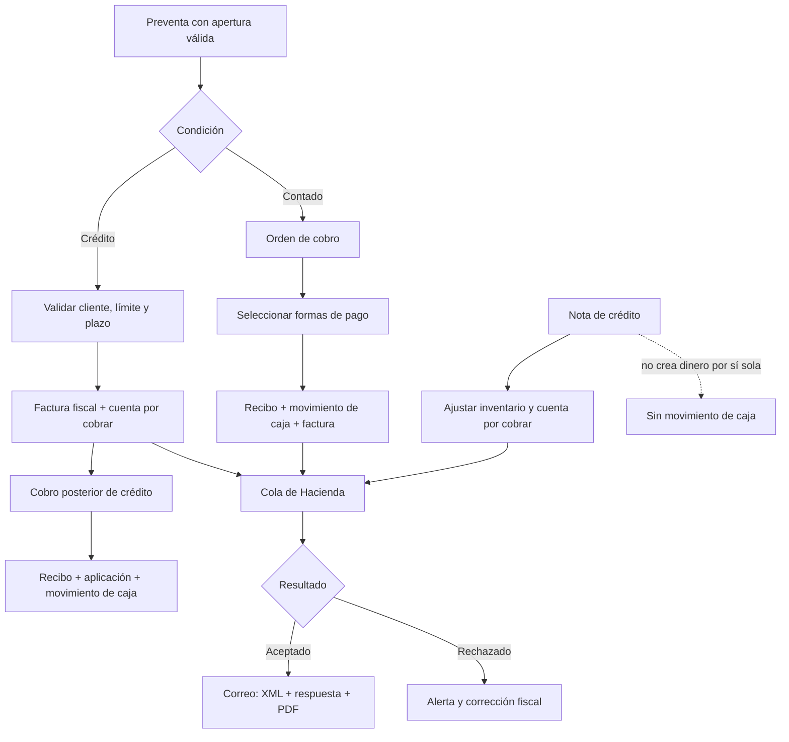

# Arquitectura de series, facturación, recibos, cobros y caja

## 1. Propósito

Este documento contrasta el proceso solicitado con el estado real de los dos proyectos:

- API: /Users/amartinez/Downloads/Git/DevSuvesaPosWeb
- Sitio Blazor: /Users/amartinez/Downloads/Git/SuvesaPosSitieWebNew

El objetivo es definir un diseño integral para:

- factura electrónica y tiquete electrónico, de contado o crédito;
- preventas y su conversión a venta;
- recibos de cobro y recibos de pago;
- cuentas por cobrar y aplicación de abonos;
- formas de pago configurables;
- apertura, arqueo y cierre de caja;
- notas de crédito electrónicas;
- series operativas no fiscales;
- envío de XML firmado, respuesta de Hacienda y PDF;
- impresión, auditoría, concurrencia, idempotencia y recuperación ante fallos.

No se propone código en este documento. Se propone el modelo funcional, la arquitectura, los contratos y un plan de implementación.

## 2. Conclusión ejecutiva

El sistema tiene piezas valiosas ya implementadas, pero el flujo completo todavía no es transaccional ni tiene una única fuente de verdad.

Las bases que conviene conservar son:

- reserva fiscal V4.4 con bloqueo de fila e idempotencia;
- cola de emisión electrónica y estados de Hacienda;
- motor de correo con cola, reintentos y alertas;
- generación PDF para factura, tiquete, nota de crédito, recibo de cobro y recibo de pago;
- mantenimiento de tipos de documento, series, plazos y formas de pago;
- pantallas de apertura, arqueo, cierre y cobro.

Las brechas más graves son:

1. Una venta o nota de crédito puede consumir dos avances de la misma serie: uno al guardar el documento y otro al reservar la numeración fiscal.
2. El cobro, la conversión de preventa, el recibo, el movimiento de caja y la emisión se ejecutan en llamadas separadas. Un fallo intermedio deja estados parciales.
3. La API acepta el número de apertura enviado por el navegador, pero no comprueba de forma central que exista, esté abierta, pertenezca a la sucursal, caja y usuario correctos.
4. Una línea de pago puede marcar toda la venta como cobrada sin validar que la suma aplicada cubra el saldo.
5. El crédito se representa principalmente con un booleano Cobrado. No existe un mayor de cuentas por cobrar capaz de expresar saldo parcial, notas de crédito, anticipos y aplicaciones.
6. La facturación valida que el cliente esté habilitado para crédito, pero no valida de forma integral su límite disponible ni asigna de forma confiable su plazo configurado.
7. La pantalla Abono Cobrar fue convertida en cobro de preventas. En este momento no resuelve el requisito de buscar facturas de crédito, aplicar abonos y emitir un recibo imprimible.
8. Las formas de pago nuevas exigen códigos numéricos de dos dígitos, mientras Cobrar identifica efectivo y tarjeta con EFE y TAR. La lógica depende de textos y códigos mágicos.
9. El cierre calcula parte del total desde ventas de contado más ventas de crédito menos devoluciones. La caja debe cuadrarse desde movimientos monetarios, no desde documentos fiscales.
10. Las series fiscales y las series operativas están mezcladas mediante banderas ambiguas.

La recomendación central es separar cinco conceptos:

- perfil o política comercial de venta;
- ámbito de numeración fiscal;
- serie operativa no fiscal;
- cuenta por cobrar y sus aplicaciones;
- movimiento monetario de caja.

El sitio no debe coordinar varios endpoints para completar una operación crítica. La API debe exponer comandos transaccionales de negocio, idempotentes, y el sitio debe limitarse a capturar y presentar el resultado.

## 3. Aclaración esencial: serie comercial frente a numeración fiscal

El consecutivo fiscal se construye con sucursal, terminal, tipo de comprobante y secuencia. Por ello no pueden existir dos contadores independientes para la misma combinación fiscal sin riesgo de producir consecutivos repetidos.

Sí pueden existir varias opciones comerciales para factura o tiquete, por ejemplo:

- Factura electrónica contado;
- Factura electrónica crédito 30 días;
- Factura electrónica crédito 60 días;
- Tiquete electrónico contado;
- otra variante autorizada por el negocio.

Pero esas opciones deben modelarse como perfiles de emisión que apuntan a un ámbito de numeración fiscal único. Si se desean secuencias fiscales realmente independientes, cada una debe utilizar una terminal fiscal distinta.

La estructura recomendada es:

- ÁmbitoNumeracionFiscal: emisor + sucursal fiscal + terminal fiscal + código de comprobante. Es dueño del contador.
- PerfilEmision: nombre comercial, condición contado/crédito, plazo, reglas de elegibilidad, prioridad y ámbito de numeración.
- SerieOperativa: numeración de recibos, compras, traslados, consignaciones, tomas y otros documentos no fiscales.

Con esto pueden configurarse varias series visibles para cada tipo sin duplicar el consecutivo que se informa a Hacienda.

## 4. Proceso objetivo

La factura de crédito pasa por Hacienda cuando nace y por Cobrar cuando se recibe el dinero. El cobro posterior no vuelve a emitir la factura. La venta de contado solo entra a la cola fiscal después de confirmar el pago local.

### 4.1 Preventa

La preventa es un documento operativo, todavía no fiscal. Debe contener:

- cliente;
- emisor;
- sucursal;
- caja y apertura de origen;
- perfil de emisión seleccionado;
- factura electrónica o tiquete electrónico;
- condición contado o crédito;
- moneda y tipo de cambio;
- líneas, impuestos, descuentos y bonificaciones;
- reservas de inventario;
- total calculado por la API;
- estado;
- usuario y trazabilidad.

Reglas:

- Por requerimiento del negocio, no se crea una preventa sin apertura válida.
- La API vuelve a calcular los totales y valida la apertura; no confía en los totales ni en el número de apertura enviados por el navegador.
- La preventa no consume numeración fiscal.
- Si se necesita un número visible de preventa, utiliza una serie operativa propia.
- La reserva de inventario y su liberación por vencimiento o anulación deben ser explícitas.

### 4.2 Venta a crédito

Al confirmar una preventa a crédito, una sola operación de la API debe:

1. volver a validar que la preventa esté vigente y no haya sido procesada;
2. comprobar que el perfil permita crédito;
3. comprobar que el cliente tenga crédito habilitado;
4. comprobar morosidad, bloqueos y demás políticas;
5. obtener el plazo configurado del cliente;
6. calcular el saldo disponible con datos actuales;
7. validar que el nuevo total no exceda el crédito disponible;
8. convertir la reserva de inventario en salida definitiva;
9. crear la factura y el débito de cuentas por cobrar;
10. reservar una sola vez el consecutivo fiscal;
11. registrar la solicitud en la cola de emisión;
12. confirmar todo o no confirmar nada.

La factura de crédito queda pendiente, parcial o pagada según su saldo, no según un booleano asignado manualmente.

La apertura asociada a la venta identifica dónde se originó. El recibo posterior puede cobrarse en otra apertura válida; ambas referencias deben conservarse y no confundirse.

### 4.3 Venta de contado

Para contado se recomienda este orden:

1. crear la preventa;
2. crear una orden de cobro pendiente;
3. mostrarla inmediatamente en Cobrar;
4. seleccionar las formas de pago configuradas;
5. confirmar el cobro;
6. dentro de una sola transacción: registrar cobro, detalle por forma de pago, movimiento de caja, recibo, venta definitiva, salida de inventario y reserva fiscal;
7. poner el comprobante en la cola de Hacienda;
8. permitir imprimir el recibo confirmado;
9. esperar la aceptación de Hacienda para enviar por correo los tres adjuntos.

No conviene llamar recibo final a un documento que todavía no se ha pagado. Antes del pago debe ser OrdenCobro o ReciboPendiente. El número definitivo de recibo se asigna al confirmar el cobro. Si el negocio exige reservarlo antes, debe existir un estado Pendiente y una anulación auditada; nunca debe imprimirse como pagado antes de aplicar el dinero.

Esta secuencia satisface la intención de que el documento aparezca inmediatamente en Cobrar sin declarar una venta como pagada antes de recibir el pago.

### 4.4 Cobro de facturas de crédito

Cobrar debe permitir buscar por:

- cédula o código de cliente;
- número interno;
- consecutivo fiscal;
- clave de Hacienda;
- fecha;
- saldo y vencimiento.

Debe mostrar únicamente documentos con saldo, junto con:

- monto original;
- notas de crédito aplicadas;
- pagos anteriores;
- saldo actual;
- plazo y fecha de vencimiento;
- moneda;
- estado de Hacienda.

Una confirmación puede aplicar un pago a una o varias facturas. Debe poder soportar abono parcial si el negocio lo autoriza. En una sola transacción se crean:

- encabezado de cobro o recibo;
- número de recibo operativo;
- aplicaciones por factura;
- pagos por forma de pago;
- movimientos de caja;
- actualización derivada de los saldos.

Después de confirmar:

- el recibo se puede imprimir;
- la factura queda Parcial o Pagada;
- no se vuelve a emitir la factura a Hacienda;
- una anulación del recibo debe crear reversos, no borrar registros.

### 4.5 Nota de crédito electrónica

La nota de crédito:

- tiene una serie fiscal propia;
- debe tener una única configuración activa dentro del alcance acordado;
- referencia una factura electrónica o tiquete aceptado;
- devuelve inventario cuando corresponda;
- afecta el saldo por cobrar, pero no genera por sí misma un ingreso o egreso de caja;
- reserva un solo consecutivo fiscal;
- se envía a Hacienda mediante la cola;
- cuando Hacienda la acepta, se envían XML firmado, XML de respuesta y PDF.

Tratamiento contable necesario:

- Si la factura tiene saldo pendiente, la nota reduce ese saldo.
- Si la factura ya estaba pagada, la nota genera crédito a favor del cliente o una obligación de reintegro, según la política elegida.
- Un reintegro efectivo es una operación monetaria independiente, autorizada y ligada a una apertura. No debe confundirse con la emisión de la nota de crédito.

Se debe impedir que la suma de notas activas exceda lo facturado por línea, considerando devoluciones anteriores y concurrencia.

### 4.6 Correo

Factura, tiquete y nota de crédito se envían al cliente únicamente después de aceptación de Hacienda.

Los adjuntos obligatorios son:

- XML firmado del comprobante;
- XML de respuesta de Hacienda;
- PDF de representación gráfica.

La política recomendada es estricta: si falta cualquiera de los tres adjuntos, el envío permanece pendiente o fallido y genera alerta. El comportamiento actual permite enviar solo los XML cuando falla el PDF; eso no cumple literalmente el proceso solicitado.

El cobro no debe esperar sincrónicamente por Hacienda ni SMTP. Debe finalizar la transacción local, mostrar estados claros y dejar que las colas reintenten:

- Pendiente de Hacienda;
- Aceptado;
- Rechazado;
- Correo pendiente;
- Correo enviado;
- Correo fallido.

## 5. Estado actual del API

### 5.1 Series

Archivos principales revisados:

- ApiSuvesaPos/ApiSuvesaPos/Class/SeriesFacturacionManagerDA.cs
- ApiSuvesaPos/SuvesaPos.Data/Models/SeriesFacturacion.cs
- ApiSuvesaPos/SuvesaPos.Data/Models/TiposFactura.cs
- ApiSuvesaPos/FacturaElectronica/V44/ReservadorNumeracionFiscal.cs

Hallazgos:

- SeriesFacturacion mezcla contador fiscal y banderas EsCredito, EsRecibo, EsPago y EsConsignacion.
- TiposFactura también contiene Contado y Credito. Existen dos fuentes para la condición.
- El mantenimiento impide duplicar emisor + sucursal + terminal + tipo, por lo que no permite varias opciones del mismo tipo en una terminal aunque difieran por condición.
- Esa validación está en código; no se observó una restricción única de base de datos que cierre la carrera entre solicitudes concurrentes.
- Si no encuentra serie de la terminal solicitada, el resolver cae sobre todas las candidatas y puede escoger la serie de otra terminal. El comentario dice que cae a una serie sin terminal, pero el filtro no implementa esa regla.
- Las banderas no tienen una matriz de compatibilidad. Una serie puede quedar marcada simultáneamente como crédito, recibo, pago o consignación sin una regla formal.
- Hay mensajes y comentarios que todavía mencionan el código 05 para nota de crédito, mientras el código usado por V4.4 es 03.
- EditarConsecutivoFactura incrementa y guarda sin bloqueo de concurrencia.

Hallazgo crítico:

- VentasManager asigna Venta.NumFactura desde la secuencia actual y llama EditarConsecutivoFactura.
- DevolucionVentaManagerDA hace un incremento semejante para la nota.
- ReservadorNumeracionFiscal vuelve a bloquear la serie, calcula Secuencia + 1 y la incrementa.
- Una factura o nota puede, por lo tanto, avanzar dos posiciones y hacer que el número interno no coincida con el fiscal.

Recomendación:

- ReservadorNumeracionFiscal debe convertirse en la única autoridad de la numeración fiscal.
- Debe definirse una sola semántica para el contador: último usado o próximo disponible. Se recomienda último usado y reserva atómica de último usado + 1.
- La venta definitiva debe almacenar el consecutivo reservado; no debe tomar el valor anterior.
- Toda combinación fiscal debe tener índice único y control de concurrencia.

### 5.2 Facturación y preventas

Archivos principales:

- ApiSuvesaPos/ApiSuvesaPos/Class/VentasManager.cs
- ApiSuvesaPos/ApiSuvesaPos/Class/PreventaManager.cs
- ApiSuvesaPos/ApiSuvesaPos/HostedServices/ReservaAutomaticaV44HostedService.cs
- ApiSuvesaPos/FacturaElectronica/V44/MapeadorPosComprobanteV44.cs

Hallazgos:

- El endpoint de venta recibe NumApertura, NumCaja, totales y condición desde el cliente.
- No existe una validación transversal de apertura abierta, sucursal, caja y usuario antes de crear la venta.
- La ruta principal asigna Cobrado = false incluso antes de conocer el resultado real del pago.
- Otra ruta de creación desde albaranes marca contado como cobrado aunque no exista un pago registrado. El significado cambia según la ruta.
- La factura normal del sitio se envía como documento final, no como preventa, salvo escenarios especiales de consignación.
- La emisión automática exige pagos para tiquete, pero permite factura electrónica de contado sin pagos. El criterio debe depender de contado/crédito, no de si el código fiscal es 01 o 04.
- El mapeador fiscal considera crédito si la serie tiene EsCredito o si existe IdPlazo. Esa decisión puede no coincidir con TiposFactura.Credito.
- Cuando una factura no tiene pagos registrados, el mapeador puede inventar un medio de pago predeterminado. Una factura de contado debe usar pagos reales; una factura de crédito no debe fingir un ingreso de caja.
- FormaPago se copia directamente al código de medio de pago de Hacienda. El código interno y el código fiscal deben ser campos separados.

### 5.3 Crédito del cliente

Archivos principales:

- ApiSuvesaPos/SuvesaPos.Data/Models/Cliente.cs
- ApiSuvesaPos/SuvesaPos.Data/Models/ConfiguracionPlazo.cs
- ApiSuvesaPos/ApiSuvesaPos/Class/ClienteManager.Data.cs
- ApiSuvesaPos/ApiSuvesaPos/Class/AbonoCobrarManager.cs

Hallazgos:

- Cliente posee MaxCredito y PlazoCredito en días.
- Venta referencia IdPlazo a ConfiguracionPlazo.
- No hay una relación canónica entre el plazo entero del cliente y el IdPlazo exigido por la venta fiscal.
- MaxCredito y PlazoCredito se mantienen en CRUD, pero no se encontró una validación transaccional del crédito disponible al facturar.
- El saldo se infiere de Venta.Cobrado y totales, no de movimientos aplicados.

Recomendación:

- Cliente debe referenciar un IdPlazoCredito activo. Durante migración se puede asociar por CantidadDias y reportar ambigüedades.
- El disponible debe calcularse dentro de la misma transacción que factura:
  - límite aprobado;
  - menos saldo abierto;
  - menos preventas o autorizaciones reservadas, si la política las considera;
  - más créditos aplicables.
- Para evitar que dos ventas simultáneas excedan el límite, se requiere bloqueo o una reserva de crédito versionada.

### 5.4 Recibos y cuentas por cobrar

Archivos principales:

- ApiSuvesaPos/ApiSuvesaPos/Class/AbonoCobrarManager.cs
- ApiSuvesaPos/ApiSuvesaPos/Class/CobrosManager.cs
- ApiSuvesaPos/SuvesaPos.Data/Models/Abonoccobrar.cs
- ApiSuvesaPos/SuvesaPos.Data/Models/DetalleAbonoccobrar.cs
- ApiSuvesaPos/SuvesaPos.Impresion/Proveedores/ProveedoresRecibos.cs

Fortaleza existente:

- Ya existe un proveedor PDF para ReciboCobro y otro para ReciboPago.

Brechas:

- El número de recibo se consulta y se envía desde el cliente; después se incrementa la primera serie EsRecibo de la sucursal. Es vulnerable a concurrencia.
- La serie de recibo no distingue de forma segura ventas, compras, emisor y terminal.
- El encabezado, los detalles y el incremento se guardan por pasos, sin una transacción única.
- La consulta de facturas por cliente contiene una condición con precedencia incorrecta: los documentos con Cobrado nulo pueden incluirse aunque pertenezcan a otro cliente.
- La consulta no filtra de forma robusta crédito, preventas, anulaciones, sucursal o saldo real.
- No existe una tabla de aplicaciones de pago con identidad propia y restricción contra sobreaplicación.
- CobrosManager guarda cada forma de pago por separado y marca la venta como cobrada durante el recorrido.
- No valida que los pagos sean positivos, que la suma neta coincida con el monto, que el documento continúe pendiente o que la forma esté autorizada.
- Un abono parcial puede terminar marcando toda la factura como cobrada.
- No hay idempotencia; un reintento de red puede duplicar pagos.
- Se relacionan documentos por combinaciones de Documento, TipoDocumento, IdDocumento y textos, no por claves fuertes.
- OpcionesDePago mezcla pagos, entregas a cuenta y referencias de documentos, lo que dificulta conciliación y reglas.

Recomendación:

- Cobro es el encabezado y a la vez el recibo comercial.
- CobroAplicacion relaciona el cobro con una o varias facturas y el monto aplicado.
- CobroFormaPago relaciona el cobro con formas configuradas, moneda, tipo de cambio y referencia.
- CuentaPorCobrarMovimiento registra débitos y créditos inmutables.
- El saldo se deriva del mayor; el estado Pendiente, Parcial o Pagada se deriva del saldo.
- Las anulaciones crean movimientos inversos.

### 5.5 Formas de pago

Archivos principales:

- ApiSuvesaPos/SuvesaPos.Data/Models/FormasPago.cs
- ApiSuvesaPos/ApiSuvesaPos/Class/FormasPagoManager.cs

Hallazgos:

- El catálogo tiene clasificación de efectivo, tarjeta, depósito y cheque.
- No tiene Activo, orden, vigencia, requiere referencia, permite vuelto, afecta caja ni código Hacienda separado.
- El mantenimiento exige código numérico de dos dígitos.
- El sistema agrega una forma sintética EAC para dinero a favor.
- El sitio identifica efectivo con EFE y tarjeta con TAR.

Recomendación:

Cada forma debe tener:

- identificador estable;
- nombre;
- activa;
- orden;
- naturaleza: efectivo, tarjeta, transferencia, cheque, depósito, crédito a favor u otra;
- código para Hacienda;
- afecta caja;
- permite vuelto;
- requiere referencia;
- permite moneda extranjera;
- reglas de conciliación.

El sitio debe usar las propiedades semánticas devueltas por la API, nunca comparar textos o códigos mágicos.

### 5.6 Caja

Archivos principales:

- ApiSuvesaPos/ApiSuvesaPos/Class/CajaManagerDA.cs
- ApiSuvesaPos/ApiSuvesaPos/Class/CierreCajaManager.cs
- ApiSuvesaPos/SuvesaPos.Data/Models/Aperturacaja.cs
- ApiSuvesaPos/SuvesaPos.Data/Models/ArqueoCaja.cs
- ApiSuvesaPos/SuvesaPos.Data/Models/CierresCaja.cs
- ApiSuvesaPos/SuvesaPos.Data/Models/MovimientoCaja.cs
- ApiSuvesaPos/SuvesaPos.Data/Models/OpcionesDePago.cs

Hallazgos:

- Apertura, arqueo y cierre existen, pero cada proceso realiza varios SaveChanges sin una transacción que proteja el estado completo.
- Los estados A, M y C son textos sin una máquina de estados central.
- No se observó una protección única de base de datos para impedir aperturas incompatibles simultáneas.
- Los cobros reciben Numapertura del cliente y no tienen una relación fuerte que garantice una apertura válida.
- El cierre suma ventas crédito, ventas contado y resta devoluciones para calcular TotalSistema.
- Una venta de crédito no cobrada no es dinero de caja.
- Un cobro posterior de crédito sí es dinero de la apertura actual.
- Una nota de crédito no es automáticamente una salida de caja.
- Por ello el total actual no representa de forma confiable el efectivo ni los medios conciliables.

Recomendación:

- La apertura debe ser un agregado con estados Abierta, EnArqueo y Cerrada.
- Solo una apertura Abierta acepta movimientos.
- Al iniciar el arqueo final se bloquean nuevos cobros, salvo reapertura autorizada y auditada.
- El cierre se calcula desde MovimientoCaja y CobroFormaPago.
- Las ventas se muestran como información comercial separada, no como fórmula monetaria.
- Toda operación monetaria registra origen, usuario, sucursal, caja, apertura, moneda, forma, monto y correlación.
- Deben existir índices y restricciones para impedir más de una apertura activa cuando la política no lo permita.

Ecuación de conciliación recomendada:

Fondo inicial + ingresos de caja - egresos - depósitos/retiros = saldo esperado por forma de pago y moneda.

Las ventas a crédito sin pago no entran. Las aplicaciones cobradas sí entran. Las notas de crédito solo entran si existe un reintegro monetario independiente.

### 5.7 Nota de crédito

Archivos principales:

- ApiSuvesaPos/ApiSuvesaPos/Class/DevolucionVentaManagerDA.cs
- ApiSuvesaPos/FacturaElectronica/V44/ReservadorNumeracionFiscal.cs
- ApiSuvesaPos/FacturaElectronica/V44/MapeadorPosComprobanteV44.cs

Hallazgos:

- Se selecciona la primera serie código 03 por sucursal y emisor, sin resolver terminal ni garantizar unicidad activa.
- Encabezado, inventario, detalles e incremento se guardan por pasos sin una transacción integral.
- También está expuesta al doble incremento de serie.
- El worker espera que exista una factura fiscal origen, lo cual es una base correcta.
- El mapeador genera la referencia fiscal al documento original.
- No hay una política completa de impacto sobre saldo pendiente o crédito a favor.

### 5.8 Correo e impresión

Archivos principales:

- ApiSuvesaPos/SuvesaPos.Correo/Worker/ProcesadorEnvioCorreoComprobantes.cs
- ApiSuvesaPos/SuvesaPos.Correo/Repositorios/RepositorioEnvioCorreo.cs
- ApiSuvesaPos/SuvesaPos.Impresion

Fortalezas:

- Los aceptados se descubren y encolan.
- Los rechazados generan alerta y no se envían como aceptados.
- Hay reintentos, reclamo con bloqueo, configuración por emisor y registro de adjuntos.
- El destino se obtiene del cliente.
- Existen plantillas para todos los documentos relevantes.

Brecha:

- Si falla el PDF, hoy se envía el correo con los XML. Debe ajustarse a la política de tres adjuntos obligatorios.
- Los recibos no forman parte de esta cola fiscal. Si se desea enviarlos también, deben tener su propia preferencia y cola; no deben compartir la clave fiscal como identidad.

### 5.9 Series no fiscales

Estado actual:

- recibos de cobro y pago reutilizan SeriesFacturacion con banderas;
- Compra usa principalmente el número externo del proveedor y su identidad interna;
- TrasladoBodega usa identidad y una referencia de documento;
- consignaciones usan identidad y referencias propias;
- TomaFisicaCabecera usa su identidad;
- no existe un catálogo uniforme de series operativas para todos esos módulos.

Recomendación:

Crear SerieOperativa con tipos separados:

- Preventa;
- ReciboCobro;
- ReciboPago;
- CompraInterna;
- TrasladoBodega;
- ConsignacionIngreso;
- ConsignacionSalida;
- TomaFisica;
- otros que se aprueben.

El número de factura del proveedor no debe reemplazarse: CompraInterna sería un número propio adicional para trazabilidad.

No debe confundirse esta serie documental con el modelo Serie utilizado para números de serie de artículos.

## 6. Estado actual del sitio Blazor

### 6.1 Facturación

Archivo principal:

- src/SuvesaPosSitioAplicacion/Views/Ventas/Facturacion.razor

Hallazgos:

- La pantalla elige tipo de factura, pero no una serie o perfil de emisión explícito.
- Filtra crédito según Abierto o Sinrestriccion del cliente.
- No muestra ni valida límite, saldo utilizado, disponible ni vencimientos.
- No asigna de forma confiable el IdPlazo proveniente del cliente.
- No exige una apertura antes de emitir desde la pantalla.
- No crea una preventa ordinaria y no envía automáticamente la venta de contado a Cobrar.
- Ejecuta una creación de factura; no orquesta recibo, caja y pago.

### 6.2 Cobrar

Archivo principal:

- src/SuvesaPosSitioAplicacion/Views/Ventas/Cobrar.razor

Fortalezas:

- solicita clave interna;
- verifica en interfaz que el usuario tenga caja abierta;
- carga las formas de pago configuradas;
- admite varias formas;
- convierte preventa y registra cobro.

Brechas:

- la verificación de caja solo está en la interfaz;
- efectivo y tarjeta dependen de EFE y TAR, incompatibles con la validación actual de códigos numéricos;
- crédito se deduce desde el texto TipoFactura;
- permite iniciar confirmación con un monto positivo, no necesariamente con cobertura exacta;
- primero registra el cobro y luego convierte la preventa;
- si falla la segunda llamada, el propio mensaje reconoce que el cobro quedó registrado sin factura;
- no crea ni imprime el recibo de cobro como parte del flujo.

### 6.3 Abono Cobrar

Archivos principales:

- src/SuvesaPosSitioAplicacion/Views/Ventas/CuentasPorCobrar.razor
- src/SuvesaPosSitioAplicacion/Views/Ventas/CuentasPorCobrar.razor.cs
- docs/ABONO_COBRAR_PREVENTAS_WEB.md

Hallazgo funcional:

- La ruta /sales/collect actualmente busca preventas pendientes, las cobra, las factura, intenta enviarlas a Hacienda y ofrece imprimir la factura o tiquete.
- No busca facturas de crédito con saldo.
- No crea el recibo clásico de Abonoccobrar.
- Cobro y facturación se llaman por separado para cada documento, por lo que un lote puede quedar parcialmente procesado.
- También depende del código EFE.

Recomendación:

- Unificar la experiencia en Cobrar.
- La vista debe tener al menos Pendientes de contado y Facturas de crédito.
- /sales/collect puede redirigir a Cobrar con la pestaña Facturas de crédito o mantenerse como entrada filtrada, pero no debe implementar un segundo motor de cobro.
- La operación crítica debe ser un único comando del API por cobro, aunque se apliquen varias facturas.

### 6.4 Caja

Archivos principales:

- src/SuvesaPosSitioAplicacion/Views/Caja/Apertura.razor
- src/SuvesaPosSitioAplicacion/Views/Caja/Arqueo.razor
- src/SuvesaPosSitioAplicacion/Views/Caja/Cierre.razor

La interfaz cubre los pasos, pero hereda los cálculos y estados débiles del API. Debe presentar:

- apertura activa;
- bloqueo de nuevas transacciones durante el arqueo final;
- totales por forma de pago y moneda provenientes del mayor de caja;
- diferencias declaradas;
- desglose comercial separado;
- cierre idempotente;
- alerta de operaciones pendientes o inconsistentes.

### 6.5 Cobertura de pruebas

Estado observado:

- El sitio tiene pruebas unitarias del cálculo básico de arqueo.
- Las pruebas E2E verifican que las rutas Cobrar y Abono Cobrar carguen.
- No se encontró una suite integral que pruebe serie + preventa + pago + recibo + caja + Hacienda + correo.
- El API tiene pruebas smoke e impresión, pero no una cobertura transaccional equivalente para este proceso.

## 7. Matriz de cumplimiento

| Requisito | Estado actual | Evaluación |
|---|---|---|
| Factura y tiquete electrónicos | Tipos y emisión V4.4 existen | Parcial |
| Varias opciones por tipo | La unicidad actual lo impide en igual terminal/tipo | No cumple |
| Series de contado y crédito | Hay banderas duplicadas entre tipo y serie | Parcial e inconsistente |
| Validar crédito disponible | Solo se observa habilitación básica | No cumple |
| Usar plazo del cliente | Cliente guarda días y venta exige IdPlazo | No cumple de punta a punta |
| Contado pasa inmediatamente a Cobrar | Facturación normal crea venta final | No cumple |
| Factura crédito aparece para cobro posterior | Existe API legacy, pero la pantalla fue reutilizada para preventas | No cumple |
| Generar recibo por cobro | Modelo y PDF existen, no están integrados al flujo actual | Parcial |
| Imprimir recibo de crédito | Motor PDF existe, interfaz no lo conecta | Parcial |
| Formas de pago configuradas | Se cargan, pero la semántica usa códigos mágicos | Parcial |
| Todo cobro afecta una apertura | La interfaz comprueba; API no lo garantiza | No cumple |
| No prevenir sin apertura | Facturación no lo exige integralmente | No cumple |
| Apertura, arqueo y cierre coherentes | Existen, pero el total mezcla ventas y dinero | Parcial |
| Enviar factura, respuesta y PDF | Motor existe después de aceptación | Parcial; PDF no es obligatorio |
| Nota de crédito fiscal única | Emisión existe; selección e incremento son frágiles | Parcial |
| Nota de crédito no afecta caja | No hay separación contable completa | Parcial |
| Series de recibos, compras, traslados, consignaciones y tomas | No hay modelo operativo uniforme | No cumple |
| Atomicidad e idempotencia | Solo algunas piezas fiscales tienen protección | No cumple |

## 8. Modelo de datos objetivo

### 8.1 Catálogos y numeración

TipoDocumento:

- Id;
- código interno estable;
- nombre;
- ámbito Fiscal u Operativo;
- código Hacienda cuando corresponda;
- naturaleza;
- activo.

AmbitoNumeracionFiscal:

- Id;
- emisor;
- sucursal;
- terminal fiscal;
- tipo fiscal;
- último consecutivo;
- activo;
- versión de concurrencia.

Restricción única:

- emisor + sucursal + terminal fiscal + tipo fiscal.

PerfilEmision:

- Id;
- nombre;
- ámbito fiscal;
- condición Contado o Credito;
- plazo predeterminado opcional;
- permite selección manual;
- es predeterminado;
- activo;
- vigencia.

Se permiten muchos perfiles por tipo. Solo uno puede ser predeterminado para la misma regla de selección. Si dos perfiles requieren contadores independientes, deben usar terminales fiscales diferentes.

SerieOperativa:

- Id;
- tipo operativo;
- sucursal;
- terminal opcional;
- prefijo visible;
- último consecutivo;
- activa;
- es predeterminada;
- versión de concurrencia.

ReservaNumeroDocumento:

- serie o ámbito;
- número;
- documento;
- estado Reservado, Confirmado o Anulado;
- fecha, usuario y motivo.

Debe tener unicidad de serie + número.

### 8.2 Venta y crédito

Preventa:

- identidad y número operativo;
- perfil de emisión;
- apertura de origen;
- estado;
- totales;
- versión de concurrencia;
- vencimiento de reserva.

Venta:

- documento fiscal reservado;
- condición;
- plazo;
- fecha de vencimiento;
- apertura de origen;
- estado fiscal;
- total.

CuentaPorCobrarMovimiento:

- cliente;
- venta;
- tipo Factura, NotaCredito, Recibo, Ajuste o Reverso;
- debe;
- haber;
- moneda;
- fecha;
- documento origen;
- movimiento reversado.

No se actualiza un saldo histórico. Se deriva del mayor o se mantiene una proyección reconstruible.

### 8.3 Cobro, recibo y caja

Cobro:

- Id;
- serie y número de recibo;
- cliente;
- apertura;
- moneda base;
- total;
- estado Confirmado o Anulado;
- clave de idempotencia;
- fecha y usuario.

CobroAplicacion:

- CobroId;
- VentaId;
- monto aplicado;
- moneda y equivalencia.

CobroFormaPago:

- CobroId;
- FormaPagoId;
- monto recibido;
- monto aplicado;
- vuelto;
- moneda;
- tipo de cambio;
- referencia.

MovimientoCaja:

- AperturaId;
- tipo de movimiento;
- forma de pago;
- ingreso o egreso;
- moneda;
- monto;
- origen;
- correlación;
- reverso.

Restricciones:

- suma de aplicaciones = total aplicado;
- suma de pagos menos vuelto = total aplicado;
- solo efectivo permite vuelto;
- no se aplica más que el saldo;
- no se registra dinero en una apertura que no esté Abierta;
- toda anulación crea reversos.

## 9. Contratos de API recomendados

Los nombres exactos pueden adaptarse al estilo existente. La propiedad importante es la atomicidad.

Consultas:

- obtener apertura actual y capacidades del usuario;
- obtener perfiles de emisión elegibles por emisor, sucursal, caja y cliente;
- obtener crédito del cliente: límite, usado, reservado, disponible, plazo y bloqueos;
- obtener preventas pendientes de cobro;
- obtener facturas de crédito con saldo;
- obtener formas de pago activas con propiedades semánticas;
- obtener estado fiscal, correo e impresión.

Comandos:

- CrearPreventa;
- AnularPreventa;
- FacturarPreventaCredito;
- ConfirmarCobroYFacturarPreventaContado;
- CobrarFacturasCredito;
- AnularCobro;
- CrearNotaCredito;
- RegistrarReintegroDeNotaCredito;
- AbrirCaja;
- IniciarArqueo;
- CerrarCaja;
- ReabrirArqueo bajo permiso especial.

Cada comando crítico debe:

- aceptar una clave de idempotencia;
- tomar usuario y sucursal desde la sesión autenticada;
- validar la apertura en servidor;
- abrir una transacción;
- bloquear filas necesarias;
- recalcular montos y saldos;
- guardar el agregado completo;
- registrar eventos de salida para Hacienda, correo u otros workers;
- devolver identificadores, números y estados;
- producir el mismo resultado ante un reintento con la misma clave.

No se deben encadenar desde Blazor llamadas como RegistrarCobro, FacturarPreventa, ReservarNumero y Emitir. Esa secuencia pertenece a la API.

## 10. Diseño recomendado del sitio

### 10.1 Facturación

La pantalla debe:

- exigir apertura antes de crear la preventa;
- mostrar emisor, caja y apertura activas;
- permitir seleccionar un PerfilEmision elegible;
- mostrar claramente Factura o Tiquete y Contado o Crédito;
- para crédito, mostrar límite, saldo, disponible, plazo y vencimiento;
- no permitir una combinación que la API haya declarado inelegible;
- guardar siempre como preventa;
- enviar contado a Cobrar;
- confirmar crédito con el comando específico;
- mostrar estado Hacienda y correo sin bloquear la operación.

### 10.2 Cobrar unificado

Pestañas recomendadas:

- Pendientes de contado;
- Facturas de crédito;
- Recibos emitidos;
- Operaciones fallidas o pendientes de revisión, solo para usuarios autorizados.

La pantalla debe:

- obtener apertura desde la API;
- mostrar solo formas activas permitidas;
- pedir referencias obligatorias;
- calcular vuelto solo en efectivo;
- permitir seleccionar una o varias facturas;
- mostrar la distribución del pago antes de confirmar;
- impedir sobreaplicación;
- enviar un solo comando;
- después del éxito ofrecer Imprimir recibo;
- para contado ofrecer además la representación de factura o tiquete cuando esté disponible;
- mostrar aceptación y correo como estados asíncronos.

### 10.3 Configuración

Separar visualmente:

- Tipos fiscales;
- Ámbitos de numeración fiscal;
- Perfiles de emisión contado/crédito;
- Serie única de nota de crédito;
- Series operativas;
- Formas de pago;
- Plazos de crédito.

La pantalla debe detectar:

- perfiles sin contador;
- más de un predeterminado;
- series sin emisor o sucursal;
- contadores duplicados;
- formas sin código Hacienda cuando sea obligatorio;
- series operativas faltantes;
- plazo del cliente sin correspondencia.

## 11. Decisiones funcionales que deben quedar cerradas

Las siguientes decisiones no impiden diseñar la base, pero sí deben aprobarse antes de completar la implementación:

1. Alcance de la serie única de nota de crédito: por emisor, por emisor y sucursal, o por emisor, sucursal y terminal. Se recomienda una configuración activa por emisor y sucursal, asociada a un terminal fiscal definido.
2. Si el tiquete electrónico puede ser a crédito dentro de la política comercial y fiscal aplicable. La arquitectura lo soporta, pero la regla debe confirmarse.
3. Si se permiten abonos parciales. Se recomienda sí, porque el modelo actual de cuentas por cobrar ya intenta representar abonos.
4. Si se aceptan sobrepagos. Se recomienda permitir vuelto únicamente en efectivo; para otros medios, rechazar o convertir el excedente en crédito a favor mediante una acción explícita.
5. Si la preventa reserva inventario y por cuánto tiempo. Se recomienda reservar y liberar por vencimiento o anulación.
6. Si la nota de crédito de una factura pagada crea saldo a favor o exige reintegro. Se recomienda crédito a favor por defecto y reintegro como operación separada.
7. Política de caja activa: una por cajero, una por terminal o ambas restricciones. Se recomienda una por terminal y que cada cajero opere únicamente sobre una apertura autorizada.
8. Si el recibo también se envía por correo. Esto es independiente del correo fiscal.
9. Tratamiento de múltiples monedas y fuente oficial del tipo de cambio al cobrar.
10. Qué hacer con una venta local cobrada cuyo comprobante sea rechazado por Hacienda. Se requiere un proceso de corrección fiscal; no se debe borrar el cobro.

## 12. Plan de implementación

### Fase 0 — Diagnóstico y congelamiento de reglas

- Aprobar las decisiones del apartado anterior.
- Inventariar series actuales, usos, terminales y secuencias.
- Detectar combinaciones fiscales duplicadas.
- Comparar Secuencia, NumFactura y ConsecutivoMh para cuantificar saltos.
- Detectar ventas marcadas cobradas sin pagos suficientes.
- Detectar pagos sin documento o sin apertura válida.
- Detectar facturas de crédito con saldo ambiguo.
- Detectar recibos duplicados y aplicaciones incompletas.
- No renumerar comprobantes aceptados por Hacienda.

Entregable: informe de saneamiento y mapa de migración.

### Fase 1 — Invariantes P0 del API

- Hacer que exista una sola autoridad de numeración fiscal.
- Corregir resolución de terminal y restricciones únicas.
- Incorporar idempotencia.
- Validar apertura en servidor.
- Eliminar la marcación Cobrado por línea de pago.
- Corregir la consulta de facturas por cliente.
- Reemplazar textos y códigos mágicos por identificadores.
- Hacer transaccionales apertura, arqueo, cierre, nota de crédito y recibos.

Esta fase debe preceder cualquier rediseño visual.

### Fase 2 — Mayor de cuentas por cobrar y recibos

- Crear movimientos de cuenta por cobrar.
- Migrar saldos verificables.
- Crear Cobro, CobroAplicacion y CobroFormaPago.
- Reservar recibos de forma atómica.
- Integrar PDF de recibo existente.
- Implementar pagos parciales, anulaciones y reversos.

### Fase 3 — Caja y conciliación

- Centralizar máquina de estados.
- Crear movimientos de caja desde cobros y reintegros.
- Calcular arqueo y cierre desde movimientos.
- Separar reportes comerciales de conciliación monetaria.
- Agregar restricciones de aperturas activas y bloqueo durante arqueo.

### Fase 4 — Orquestación de venta

- Convertir la factura normal en preventa.
- Implementar FacturarPreventaCredito.
- Implementar ConfirmarCobroYFacturarPreventaContado.
- Validar límite y plazo dentro de la transacción.
- Unificar el criterio contado/crédito para factura y tiquete.
- Publicar emisión fiscal mediante outbox.

### Fase 5 — Nota de crédito

- Configurar su ámbito único.
- Hacer atómica devolución, inventario, cuenta por cobrar y numeración.
- Implementar crédito a favor o reintegro.
- Proteger cantidades acumuladas por línea.

### Fase 6 — Correo e impresión

- Exigir los tres adjuntos antes de marcar enviado.
- Integrar impresión del recibo al resultado del cobro.
- Agregar correo de recibos solo si se aprueba.
- Exponer estados y reintentos en el sitio.

### Fase 7 — Series operativas

- Crear catálogo y contador separado.
- Migrar recibos de venta y compra.
- Incorporar números internos de compra, traslado, consignación y toma física.
- Mantener las referencias externas de proveedor por separado.

### Fase 8 — Sitio Blazor

- Rediseñar Facturación alrededor de preventa y perfil.
- Unificar Cobrar y Abono Cobrar.
- Agregar consulta e impresión de recibos.
- Rediseñar configuración de series.
- Mostrar saldos, plazos y estados asíncronos.
- Retirar los flujos duplicados solo después de migrar y probar.

### Fase 9 — Despliegue controlado

- Ejecutar migración sin renumerar históricos.
- Activar por sucursal o terminal.
- Conciliar cada apertura durante el piloto.
- Mantener alertas de duplicado, saldo negativo y pago huérfano.
- Retirar tablas o endpoints legacy únicamente después de un período de lectura compatible y auditoría.

## 13. Pruebas obligatorias

### Series y concurrencia

- cien emisiones paralelas nunca repiten consecutivo;
- un reintento devuelve el mismo documento;
- perfiles distintos que comparten ámbito usan un solo contador;
- no hay salto doble;
- una terminal no puede tomar la serie de otra.

### Contado

- sin apertura se rechaza la preventa;
- con apertura se crea orden de cobro;
- pago exacto confirma recibo, venta, caja y cola fiscal;
- vuelto solo se permite en efectivo;
- un fallo en cualquier punto revierte toda la operación local;
- un reintento no duplica cobro ni factura.

### Crédito

- cliente sin crédito se rechaza;
- límite insuficiente se rechaza;
- dos ventas concurrentes no exceden el límite;
- se usa el plazo configurado;
- la factura crea saldo, no movimiento de caja;
- abono parcial conserva saldo;
- pago total liquida y genera recibo.

### Caja

- no se paga en apertura cerrada o en arqueo;
- cada forma y moneda concilia;
- venta crédito sin pago no aumenta caja;
- pago posterior sí aumenta la apertura donde se cobró;
- nota de crédito no reduce caja;
- reintegro autorizado sí crea egreso;
- cierre repetido es idempotente.

### Nota de crédito

- referencia un comprobante válido;
- no excede cantidades ni monto restantes;
- reduce cuenta por cobrar o crea crédito a favor;
- reserva un único consecutivo;
- se envía a Hacienda y luego por correo con tres adjuntos.

### Correo

- solo aceptados se envían;
- falta de XML, respuesta o PDF impide marcar Enviado;
- reintentos no duplican un envío confirmado;
- cambio de correo queda auditado;
- ausencia de destinatario queda visible.

### E2E del sitio

- Facturación contado abre Cobrar y termina con recibo imprimible;
- Facturación crédito muestra límite y vencimiento;
- Cobrar encuentra factura de crédito por cédula y número;
- cierre refleja los cobros reales;
- estados Hacienda y correo se actualizan sin repetir la operación.

## 14. Observabilidad, seguridad y auditoría

Cada operación debe registrar:

- identificador de correlación;
- clave de idempotencia;
- usuario autenticado;
- sucursal, caja y apertura;
- fecha local y UTC;
- documento origen y resultado;
- cambios de estado;
- reversos;
- error técnico sin exponer datos sensibles.

Alertas recomendadas:

- serie próxima a agotarse;
- intento de duplicación;
- apertura inválida;
- diferencia de conciliación;
- pago huérfano;
- saldo negativo;
- rechazo de Hacienda;
- correo sin adjuntos;
- worker atrasado;
- preventa reservada vencida.

La API obtiene usuario y sucursal de la sesión. Un permiso de pantalla no basta; los comandos requieren permisos de acción para facturar, cobrar, anular, reabrir caja, emitir nota y reintegrar.

## 15. Criterios de aceptación final

La mejora se considera terminada cuando:

- ningún documento fiscal consume más de un consecutivo;
- no existe duplicidad bajo concurrencia;
- contado no puede facturarse sin pago confirmado;
- crédito no puede facturarse sin límite y plazo válidos;
- toda entrada o salida monetaria pertenece a una apertura;
- toda apertura se puede conciliar desde movimientos;
- una factura soporta saldo pendiente, parcial y pagado;
- todo pago confirmado produce un recibo único e imprimible;
- una nota de crédito no altera caja salvo reintegro separado;
- factura, tiquete y nota aceptados se envían con XML, respuesta y PDF;
- el sitio usa un único flujo de Cobrar;
- ninguna operación crítica depende de varias llamadas coordinadas por el navegador;
- existen pruebas de concurrencia, rollback, idempotencia y E2E.

## 16. Prioridad inmediata

Antes de agregar más pantallas o series, se recomienda atender en este orden:

1. detener el doble avance de numeración;
2. impedir cobros sin apertura válida en el API;
3. hacer atómico cobro + recibo + venta + caja;
4. reemplazar Cobrado por saldos y aplicaciones;
5. corregir formas de pago y códigos semánticos;
6. hacer que cierre se base en movimientos;
7. implementar crédito disponible y plazo;
8. unificar Cobrar y Abono Cobrar;
9. separar numeración fiscal y operativa;
10. endurecer correo a tres adjuntos.

Estas diez acciones eliminan primero los riesgos de duplicidad fiscal, dinero mal aplicado y cajas imposibles de conciliar.
