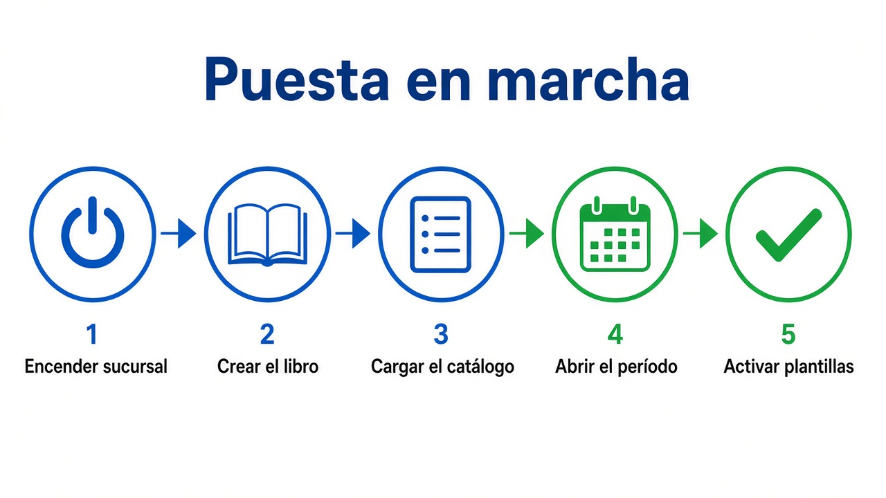
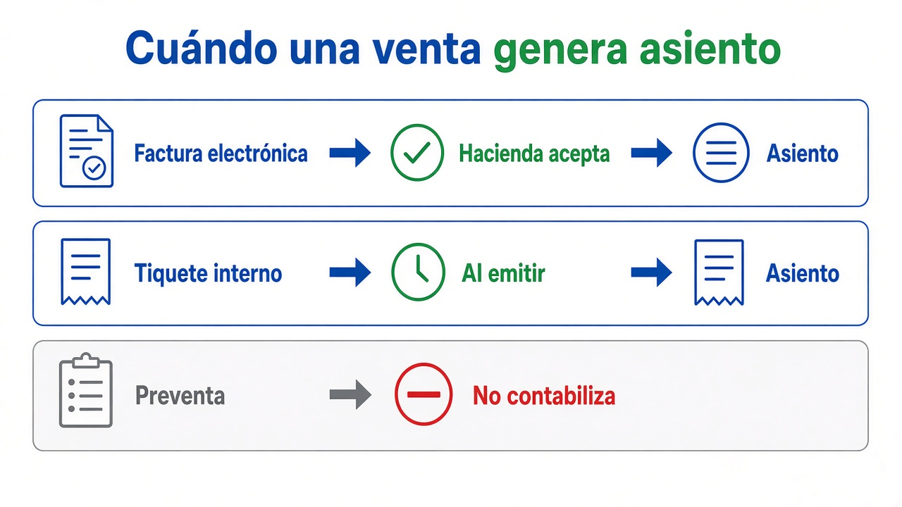
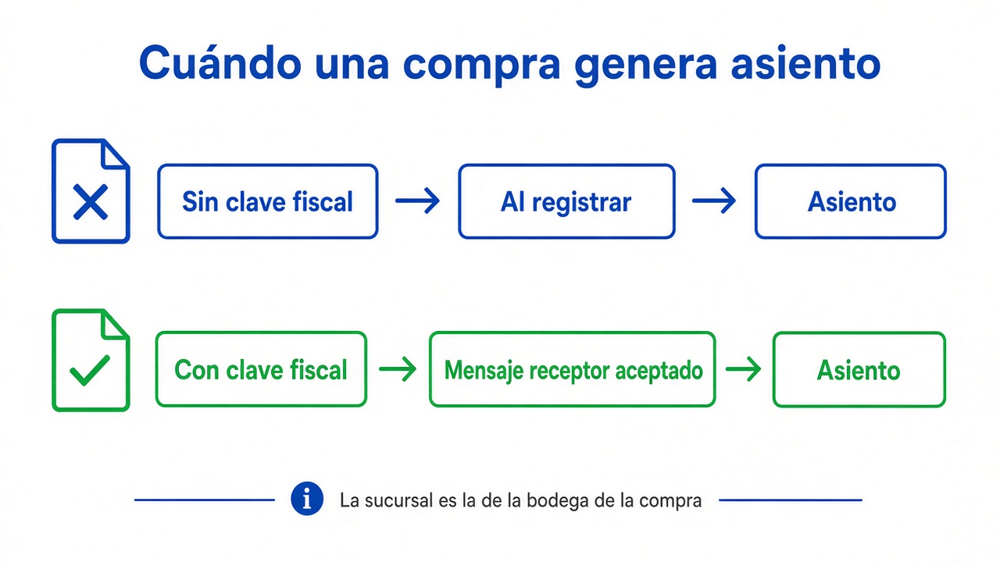
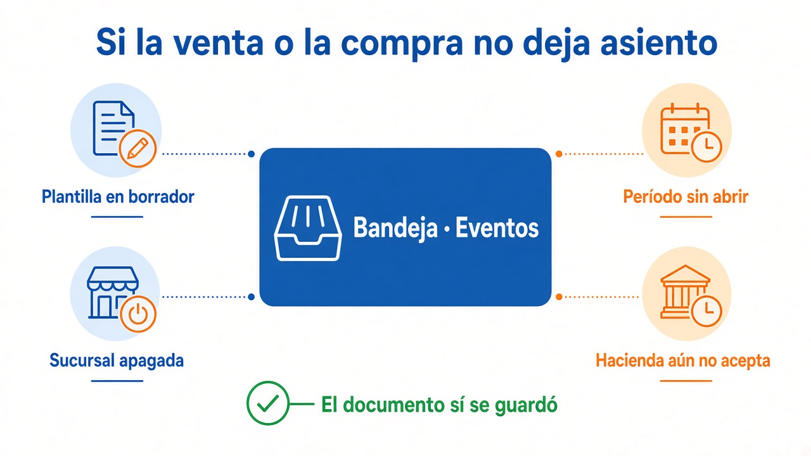

# Manual de usuario — Contabilidad

Guía para poner en marcha el módulo y para el trabajo de cada día. El libro es del **emisor**. El interruptor es la **sucursal**. Si la contabilidad no está lista, la venta o la compra **sí se guarda**; el asiento espera a que falte lo que falte.

## Antes de empezar

Necesita un emisor (Parámetros → Emisores) y una sucursal. El menú **Contabilidad** aparece en cuanto la sucursal de su centro está resuelta. Mientras esté apagada, solo se ve **Configuración emisor**. El resto del menú aparece al encenderla.

| Pantalla | Para qué sirve |
|---|---|
| Configuración emisor | Encender la sucursal, crear el libro y elegir las cuentas de uso |
| Catálogo cuentas | Ver, agregar y corregir las cuentas |
| Plantillas | Decidir cómo se arma cada asiento y activarlo |
| Cierre | Abrir, cerrar y reabrir los meses |
| Bandeja | Ver qué se contabilizó, hacer un asiento a mano y revisar lo que falló |
| Diario y Mayor | Consultar las pólizas y el movimiento de una cuenta |
| Auxiliar CxC, CxP e Inventario | Comparar el auxiliar operativo con el mayor |
| Balanza, Estado de resultados, Balance general, Flujo de efectivo | Consultar los estados |
| Cierre anual | Cerrar el ejercicio cuando los doce meses ya están cerrados |
| Reproceso | Volver a armar pólizas de un rango, primero en simulación |
| Dimensiones | Centros de costo u otra clasificación, si el contador la pide |
| Bitácora | Quién cambió cuentas, plantillas o períodos |

## 1. Encender la sucursal y crear el libro

1. Abra **Contabilidad → Configuración emisor**.
2. Elija **Empresa**, **Sucursal** y **Emisor**.
3. Pulse **Encender sucursal**. El estado de la sucursal pasa a **Encendida**.
4. Pulse **Crear libro del emisor**. Si esa sucursal todavía no estaba ligada al emisor, el mismo botón la deja vigente y crea el libro.
5. Espere a ver los cuatro estados juntos: sucursal **Encendida**, libro **Creado**, relación **Vigente** y contabilidad efectiva **Activa**.

La contabilidad efectiva pide las tres piezas. Con una sola, el documento se guarda y no hay asiento.

Para apagar la sucursal use **Apagar sucursal**. Los documentos siguen guardándose; dejan de contabilizarse.

## 2. Cargar el catálogo

1. Abra **Contabilidad → Catálogo cuentas**.
2. Elija la misma empresa y el mismo emisor.
3. Si el libro está vacío, pulse **Cargar catálogo Tico Foodster**.

Ese catálogo es el punto de partida. Los códigos se pueden cambiar, agregar y editar. Una cuenta marcada **Control** no admite un asiento directo salvo que se confirme la contraseña. Una cuenta de grupo no admite movimiento; el asiento usa la cuenta hija.

La carga también deja las plantillas en **borrador**. No contabilizan hasta que las active, en el paso 4.

Códigos con los que arranca el catálogo, y que usted puede apuntar a otra cuenta:

| Uso | Código sugerido |
|---|---|
| Retención a proveedores | 2.1.3.2 |
| Banco en dólares | 1.1.2.2 |
| Depósitos y cheques en tránsito | 1.1.2.3 |
| Comisiones por pagar | 2.1.2.5 |
| Cuentas por cobrar | 1.1.4.1 |
| Ventas gravadas | 4.1.2 |
| Descuento sobre ventas | 4.1.3 |
| IVA devengado | 2.1.3.1 |
| Inventario | 1.1.6.1 |
| IVA soportado | 1.1.7.1 |
| Cuentas por pagar | 2.1.1.1 |
| Banco en colones (sugerido en el pago) | 1.1.2.1 |
| Caja cobro ruta (sugerida en el cobro) | 1.1.1.2 |

## 3. Elegir las cuentas de uso

1. Vuelva a **Configuración emisor**, con el libro ya creado.
2. En **Cuentas de uso** elija la cuenta de este libro para retención, banco en dólares, tránsito y comisiones por pagar.
3. Pulse **Guardar cuentas de uso**.

Si acaba de cargar el catálogo vacío, esas cuatro ya vienen propuestas. Si el libro ya existía, elíjalas a mano. **Sin asignar** deja el uso vacío.

La retención y las comisiones por pagar se toman de aquí al contabilizar, aunque la plantilla muestre el código sugerido. El banco en dólares y el tránsito quedan listos para cuando una plantilla los use.

## 4. Abrir el período

1. Abra **Contabilidad → Cierre**.
2. Elija empresa y emisor.
3. Indique el **ejercicio** y el **mes**.
4. Pulse **Abrir período**.

El mes nace **abierto**. Los asientos solo entran en un mes abierto y en la fecha de ese mes. Abra cada mes que vaya a usar. Puede dejar varios abiertos.

Más adelante, en la misma pantalla:

1. Elija el período en la lista.
2. **Ejecutar pre-cierre** muestra si el mes puede cerrarse.
3. **Cerrar período** impide asientos nuevos en ese mes.
4. **Reabrir** pide contraseña y reabre ese mes y los posteriores que sigan cerrados.
5. **Bloquear** es definitivo: ese mes ya no se reabre.

## 5. Revisar y activar las plantillas

1. Abra **Contabilidad → Plantillas**.
2. Elija empresa y emisor.
3. En la plantilla, pulse **Versiones**.
4. Pulse **Detalle** o **Simular** y confirme las cuentas.
5. Pulse **Activar**. Desde ese momento los eventos de ese tipo usan esa versión.

Mientras la versión diga **Borrador**, el documento se guarda y no hay póliza.

| Plantilla | Cuándo se usa | Borrador sugerido |
|---|---|---|
| VentaEmitida | Al emitir o al aceptar la venta | Débito por cobrar (total), débito descuento, crédito ventas (subtotal), crédito IVA |
| CobroAplicado | Al aplicar un cobro ya confirmado | Débito caja, crédito por cobrar |
| NotaCreditoEmitida | Al emitir la nota de crédito | Espejo de la venta |
| CompraRegistrada | Al registrar o al aceptar la compra | Débito inventario (base menos descuento), débito IVA soportado, crédito por pagar |
| DevolucionCompraRegistrada | Al registrar la devolución de compra | Débito por pagar, crédito inventario |
| PagoProveedorAplicado | Al pagar al proveedor | Débito por pagar, crédito banco por el neto, crédito retención |
| ComisionLiquidada | Al liquidar comisiones | Débito gasto, crédito comisiones por pagar |
| ImportacionCerrada | Al cerrar la importación | Débito inventario, crédito por pagar |

En el pago, la retención usa el porcentaje de la ficha del proveedor y la cuenta de uso de retención. Si el porcentaje está vacío o en cero, esa línea no se genera.

## 6. Porcentaje de retención del proveedor

1. Abra **Compras → Proveedores**.
2. Edite el proveedor.
3. En **Retención (%)** escriba el porcentaje de ese proveedor. Por ejemplo, 2.
4. Guarde.

Vacío o cero: a ese proveedor no se le retiene. El 2 % no es un valor fijo para todos. Cada ficha dice si aplica y con qué porcentaje.

Al pagar, la retención es `monto × porcentaje / 100`, redondeada a dos decimales. El banco recibe el total menos esa retención.

## 7. Qué hace falta para que una venta deje asiento

Además de los pasos 1 a 5:

1. La venta tiene que ser una **factura**, no una preventa. La preventa reserva inventario; el asiento nace cuando se factura.
2. La sucursal de esa venta tiene que estar encendida y ligada al emisor de la factura.
3. La fecha de la venta tiene que caer en un período **abierto**.
4. La plantilla **VentaEmitida** tiene que estar **activa**.
5. Si es **factura electrónica**, el asiento espera a que Hacienda la deje en **Aceptado** o **Aceptado parcial**.
6. Si es **tiquete interno**, el asiento se genera al emitirlo.

El cobro es otro asiento, con la plantilla **CobroAplicado**. Un depósito o cheque pendiente no se contabiliza hasta confirmarlo.

## 8. Qué hace falta para que una compra deje asiento

Se piden los mismos cuatro preparativos, con la plantilla **CompraRegistrada** activa.

1. La sucursal que cuenta es la de la **bodega** de las líneas de la compra. Esa sucursal tiene que estar encendida y ligada al emisor.
2. La fecha de la compra tiene que caer en un período abierto.
3. Si la compra **no trae clave fiscal**, el asiento se genera al registrarla.
4. Si **trae clave fiscal**, espera a que el mensaje receptor quede en **Aceptado** o **Aceptado parcial**.

El pago al proveedor es otro asiento: **PagoProveedorAplicado**.

## 9. Asiento manual

1. Abra **Contabilidad → Bandeja**.
2. Elija empresa y emisor.
3. Abra la pestaña **Pólizas**.
4. Pulse **Nueva póliza manual**.
5. Elija la sucursal encendida y ligada a ese emisor, y la fecha contable. Esa fecha tiene que estar en un período abierto.
6. En cada línea elija débito o crédito, una cuenta que admita movimiento, un monto mayor a cero y, si quiere, una descripción.
7. La suma de los débitos tiene que ser igual a la suma de los créditos.
8. Guarde.

El cliente es opcional. Si una línea usa una cuenta de **control**, el sistema pide su contraseña antes de registrar. La póliza queda en la misma pestaña. Desde **Detalle** se ven las líneas. **Reversar** pide la contraseña y deja el asiento contrario.

## 10. Si no aparece el asiento

1. Abra **Contabilidad → Bandeja**, pestaña **Eventos**.
2. Lea el estado y el mensaje de la fila.
3. Corrija la causa (plantilla, período, sucursal o aceptación de Hacienda).
4. Pulse **Reintentar** en esa fila.

Causas habituales:

| Lo que ve | Qué falta |
|---|---|
| No hay fila en Eventos | La sucursal está apagada, no está ligada al emisor, o el documento todavía no debe contabilizarse (preventa, factura electrónica sin aceptación, compra con clave sin mensaje receptor) |
| Error de configuración, plantilla | Active la plantilla de ese evento |
| Error de período | Abra el mes de la fecha del documento |
| El asiento no cuadra | Revise la plantilla con **Simular** y corríjala antes de activar otra versión |

## 11. Consultar

En **Diario** y **Mayor** elija empresa, emisor y el período abierto o cerrado que quiera leer. El mayor pide además la cuenta.

Los estados se consultan en su pantalla, con la fecha de corte o el rango, y se pueden descargar en CSV:

- **Balanza**
- **Estado de resultados**
- **Balance general**
- **Flujo de efectivo**

**Auxiliar CxC**, **Auxiliar CxP** y **Auxiliar inventario** comparan el saldo operativo con el mayor. **Conciliar** busca diferencias. **Resolver** pide motivo y contraseña para dejar constancia.

**Bitácora** lista quién creó o cambió cuentas, plantillas, períodos y relaciones.

## 12. Cierre anual

1. Abra **Contabilidad → Cierre** y abra los doce meses del ejercicio, si aún no existen.
2. Cierre cada mes cuando ya no deba recibir asientos.
3. Abra **Contabilidad → Cierre anual**, elija el ejercicio y pulse **Consultar**.
4. Cuando los doce meses existan y ninguno esté abierto, pulse **Ejecutar cierre anual**.
5. Si el cierre ya existe, puede **Adjuntar** la autorización.

## 13. Reproceso y dimensiones

**Reproceso** sirve para volver a generar pólizas de un rango. Primero **Simular**. La ejecución no toca los libros hasta que pulse **Aprobar** y confirme la contraseña.

**Dimensiones** se usa cuando el contador quiere clasificar líneas (por ejemplo, un centro). Cree la dimensión, sus valores, y luego úselos en las líneas de plantilla que lo pidan. Si no las necesita, esta pantalla puede esperar.

## Lista de un arranque

- [ ] Sucursal encendida
- [ ] Libro del emisor creado y relación vigente
- [ ] Catálogo cargado o armado a mano
- [ ] Cuentas de uso guardadas
- [ ] Mes de trabajo abierto
- [ ] Plantillas del día activadas, después de revisarlas
- [ ] Porcentaje de retención en los proveedores que corresponda
- [ ] Una venta o una compra de prueba, y el asiento visible en **Bandeja → Pólizas**
